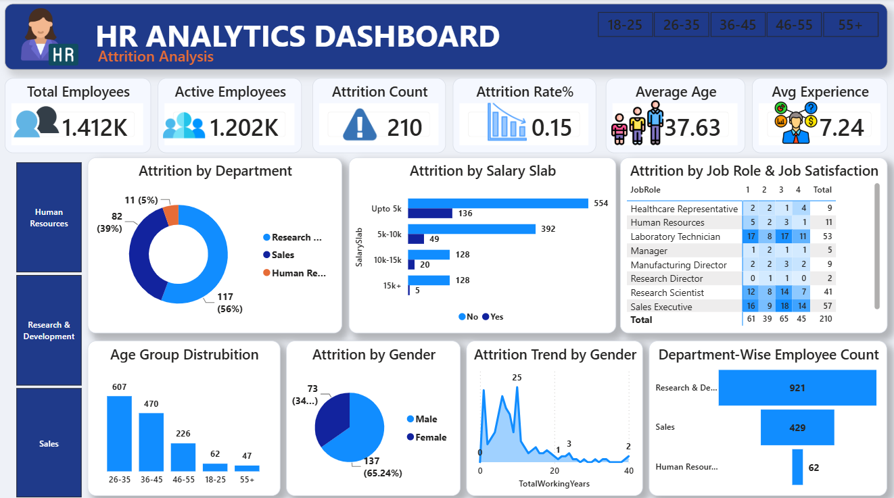
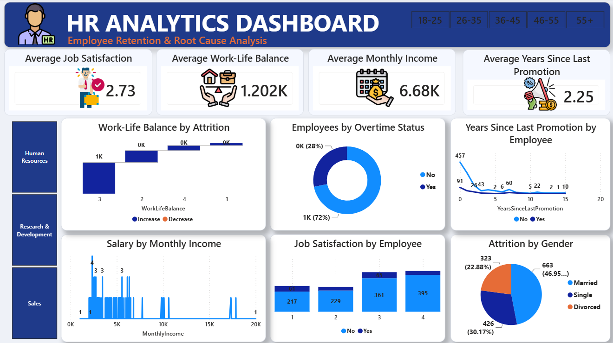

# HR-Analytics-PowerBI-Dahboard
Interactive Power BI dashboard analyzing employee attrition, workforce demographics, job satisfaction, salary trends, and HR performance insights.

# 👥 HR Analytics Dashboard — Employee Attrition Analysis

# 🔍 Analysis Key

This dashboard was designed to answer important HR business questions:

* How many employees are currently active?
* What is the overall employee attrition rate?
* Which departments have the highest employee turnover?
* Does salary level influence employee attrition?
* Which age groups have higher attrition risk?
* How does job satisfaction affect employee retention?
* Which job roles experience higher employee turnover?
* Does overtime impact employee attrition?
* How are employees distributed across departments?
* What factors contribute to employee retention problems?

---

# 🗝 Key Concepts Used

## 📊 Data Cleaning & Transformation

* Preparing HR employee data for analysis
* Handling missing and inconsistent values
* Creating structured fields for employee segmentation
* Preparing numerical and categorical columns

## 🔗 Data Modeling

* Building Power BI data model
* Creating relationships between HR analysis fields
* Preparing data for interactive reporting

## 🧮 DAX Measures

Created analytical measures including:

* Total Employees
* Active Employees
* Attrition Count
* Attrition Rate %
* Average Age
* Average Experience
* Average Job Satisfaction
* Average Monthly Income
* Average Work-Life Balance
* Average Years Since Last Promotion

## 👥 HR Analytics Techniques

Used analytical methods to understand:

* Employee retention
* Attrition drivers
* Workforce demographics
* Department performance
* Salary impact
* Satisfaction analysis

## 🎨 Data Visualization

Dashboard visuals include:

* KPI Cards
* Donut Charts
* Bar Charts
* Line Charts
* Waterfall Charts
* Tables / Matrices
* Interactive Slicers

---

# 📊 Outputs

## 📌 Page 1 — HR Analytics Dashboard

**Employee Retention & Root Cause Analysis**



This page provides an overview of employee satisfaction and possible factors influencing retention.

### Main KPIs:

* Average Job Satisfaction
* Average Work-Life Balance
* Average Monthly Income
* Average Years Since Last Promotion

### Visual Analysis:

### ⚖️ Work-Life Balance by Attrition

Analyzes whether work-life balance differences are connected with employee turnover.

### ⏰ Employees by Overtime Status

Shows employee distribution based on overtime work and its relationship with attrition.

### 📈 Years Since Last Promotion by Employee

Analyzes whether promotion delays affect employee retention.

### 💰 Salary by Monthly Income

Shows employee income distribution.

### ⭐ Job Satisfaction by Employee

Compares satisfaction levels between employees who stayed and employees who left.

### 👤 Attrition by Gender

Analyzes turnover differences across gender groups.


---

# 📌 Page 2 — Attrition Analysis Dashboard


This page focuses on identifying the main causes and patterns behind employee attrition.

### Main KPIs:

* Total Employees: 1.41K
* Active Employees: 1.20K
* Attrition Count: 210
* Attrition Rate: 15%
* Average Age: 37.63
* Average Experience: 7.24 Years

### Visual Analysis:

### 🏢 Attrition by Department

Shows which departments have the highest employee turnover.

### 💵 Attrition by Salary Slab

Analyzes whether salary ranges influence employee decisions.

### 💼 Attrition by Job Role & Job Satisfaction

Identifies roles with higher attrition risk.

### 🎂 Age Group Distribution

Shows workforce distribution by age categories.

### 👥 Attrition by Gender

Compares attrition patterns between male and female employees.

### 📅 Attrition Trend by Gender

Shows employee turnover changes over working years.

### 🏬 Department-Wise Employee Count

Displays workforce distribution across departments.


---

# 📌 Dataset Summary

| Metric           |             Value |
| ---------------- | ----------------: |
| Total Employees  |             1,470 |
| Active Employees |             1,233 |
| Attrition Count  |               237 |
| Attrition Rate   |              ~16% |
| Features         | 35+ HR attributes |

Dataset includes information about:

* Employee demographics
* Job roles
* Departments
* Salary
* Satisfaction levels
* Work-life balance
* Promotion history
* Attrition status

---

# 🚀 How to Run

## Requirements

* Microsoft Power BI Desktop
* CSV Dataset

## Steps

1. Clone this repository:

```bash
git clone <your-repository-url>
```

2. Open:

```
HR Analytics Dashboard.pbix
```

with Power BI Desktop.

3. Make sure the dataset file exists:

```
HR_Analytics-4 (1).csv
```

4. If Power BI cannot locate the dataset:

```
Power BI
→ Transform Data
→ Data Source Settings
→ Change Source
```

5. Select the CSV file location.

6. Click **Refresh**.

7. Use slicers and filters to explore HR insights.

---

# 📁 Repository Structure

```text
hr-analytics-powerbi-dashboard/

│
├── HR Analytics Dashboard.pbix
├── HR_Analytics-4 (1).csv
├── README.md
│
└── images/
    ├── page1.png
    └── page2.png
```

---

# 📝 Notes

* This project was created for HR analytics and portfolio purposes.
* The dataset contains employee-level information for analyzing attrition patterns.
* Dashboard insights are generated using Power BI calculations and visualizations.
* Power BI `.pbix` files cannot be previewed directly on GitHub, therefore screenshots are included.
* Attrition analysis helps organizations understand employee turnover risks and improve retention strategies.

---

# 👤 About Me


📩 Contact: [govharorucova@outlook.com] 🌐 GitHub: [https://github.com/GovharOrujova]

[https://www.linkedin.com/in/govhar-orujova-64333b369/]
